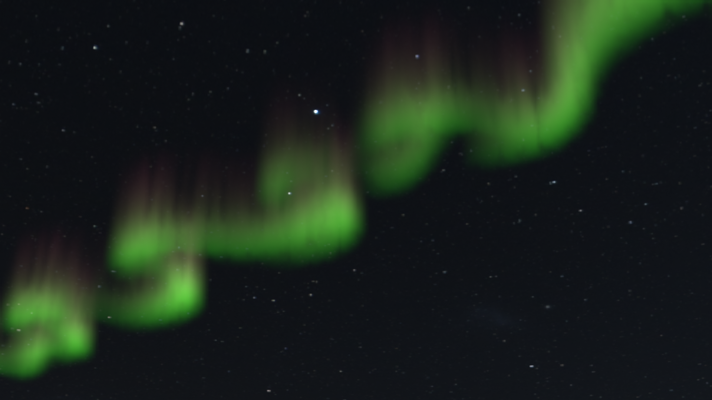

# Visualization of Aurora using Fluid Dynamics
Made for a course at KTH DH2323 VT25 Computer Graphics and Interaction

The project development blog can be found [here](https://kseniabez.github.io/projects/aurora-simulation/index.html).
